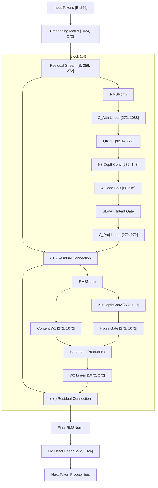

# 🐉 Neon167: Scaled Full Conv-Attention (The Giant)

Neon167 is the flagship of the **5M Parameter Class**, representing the successful transition of the project's architectural discoveries from small-scale (3M) to medium-scale (5M) general knowledge modeling. It currently holds the **Co-SOTA** title for Wiki103 generalization.

## 📊 Performance Summary

| Dataset | Metric | neon116 (3M Baseline) | **neon167 (5M Champion)** | Relative Gain |
| :--- | :--- | :--- | :--- | :--- |
| **Wiki103 / Tok4** | Val Loss | 3.2499 | **3.1484** | **+3.1%** |

## 🏗️ Architectural Core

Neon167 is a direct, vertical scale-up of the **Full Blur** architecture first established in `neon116`. It confirms that the dual-level context requirement (Locally-Aware Attention + Hydra MLP) scales linearly with parameter count.

### 1. The "Full Blur" Synergy
Unlike models that attempt to harvest parameters by removing convolutions (like `neon130` or `neon180`), Neon167 applies $k=3$ depthwise convolutions to every search and content signal in the attention block.
- **Attention Blur**: $Q, K, V,$ and $I$ (Intent) all receive a local context filter before processing.
- **MLP Foundation**: The Hydra MLP utilizes a **$k=9$** depthwise convolution to generate its gating signal, ensuring the "database" of facts is activated based on a semantic window rather than isolated tokens.
- Discovery: At the 5M scale, this "Blur everything" strategy provides the most robust regularization for the complex structural jumps within Wikipedia text.

### 2. Giant Scaling Laws
Through the transition to 5M parameters, we observed several key "Giant" properties:
- **Quantity Meets Quality**: Increasing the MLP width from the 3M standard (d_ff=507) to the 5M standard (**d_ff=1072**) resulted in an immediate jump in factual retrieval precision.
- **Resilience to Depth**: While `neon116` was sensitive to initialization, the wider 5M footprint of `neon167` exhibits significantly higher stability during the late-stage convergence on Wiki103.

### 3. Verification of Multi-Head Intent (MHI)
Neon167 utilizes **Multi-Head Intent (MHI)**, where each of the **4 attention heads** has its own independent gating projection. 
- Discovery: Despite the success of MQI (Shared Intent) at 3M, Neon167 proves that at larger scales, **Parallel Filtering Diversity** is more valuable than the parameter savings used to widen the MLP further.

## ⚖️ Parameter Calibration
Neon167 is precisely calibrated to **5,283,056** parameters:
- **d_model**: 272
- **n_layers**: 4
- **d_ff**: 1072 (4x expansion)
- **Head Diversity**: 4 Heads (68-dim each)

## 🔭 Summary
Neon167 proves that the **Synergy Architecture** is not just a small-scale heuristic but a viable foundation for scaling. It serves as the baseline against which all hierarchical and spectral "Goliaths" are measured.

## 🎓 Pedagogical Walkthrough: The Data Pipeline

To understand Neon167, we follow the life of a sequence through its **5.28M** parameters.

### Phase 1: Ingestion & Embedding
1.  **Tokenization**: The input text is represented as a list of integers. Neon167 processes blocks of **256 tokens** at a time.
2.  **Embedding**:
    *   **Layer**: `nn.Embedding(1024, 272)`
    *   **Matrix**: A weight matrix of shape **[1024, 272]**.
    *   **Result**: Each token ID is looked up to produce a **272-dimensional** vector.
    *   **Data Shape**: `[Batch, 256, 272]`.

### Phase 2: The Transformer Blocks (Stack of 4)
The data flows through 4 identical blocks. Each block has two internal "sub-brains": **Attention** and **MLP**.

#### Step A: Locally-Aware Conv-Attention
This layer allows tokens to "search" for relevant neighbors.
1.  **Normalization**: Input is stabilized via `RMSNorm(272)`.
2.  **Projection (The Split)**: 
    *   **Layer**: `nn.Linear(272, 1088, bias=False)`
    *   **Matrix**: **[272, 1088]** (Input Dim $\times$ 4).
    *   **Operation**: Projects the hidden state into 4 segments: **Query (Q)**, **Key (K)**, **Value (V)**, and **Intent (I)**.
    *   **Result**: 4 matrices of shape `[Batch, 256, 272]`.
3.  **The QKVI Blur (Context Filter)**:
    *   **Layer**: 4 parallel `nn.Conv1d(272, 272, kernel_size=3, groups=272, bias=False)`.
    *   **Filters**: 4 weight matrices of shape **[272, 1, 3]**.
    *   **Operation**: Each channel performs a local 3-token neighborhood average. This makes the search robust to local noise.
4.  **Multi-Head Splitting**:
    *   The 272 channels are split into **4 Heads**.
    *   **Head Dimension**: $272 / 4 = \mathbf{68}$.
    *   **Shapes**: Q, K, V, I now exist as `[Batch, 4, 256, 68]`.
5.  **Attention Logic**:
    *   **Matching**: $Q \times K^T \to$ **[Batch, 4, 256, 256]** (The score card).
    *   **Retrieval**: Score Card $\times V \to$ **[Batch, 4, 256, 68]**.
    *   **Intent Gating**: Retrieval $\times \text{Sigmoid}(I) \to$ Each head's output is weighted by its locally-aware "intention."
6.  **Final Merge**:
    *   **Layer**: `nn.Linear(272, 272, bias=False)`
    *   **Matrix**: **[272, 272]**.
    *   **Result**: Merges the 4 heads back into a single 272-dim vector.

#### Step B: The Hydra MLP
This is the model's "Knowledge Base."
1.  **Topic Sensing**:
    *   **Layer**: `nn.Conv1d(272, 272, kernel_size=9, groups=272, bias=False)`.
    *   **Filter**: **[272, 1, 9]**.
    *   **Logic**: The model "reads" a 9-token window to decide which internal facts are relevant.
2.  **The Fact Expansion**:
    *   **Layer**: `nn.Linear(272, 1072, bias=False)`.
    *   **Matrix**: **[272, 1072]** (Expansion to 4$\times$ capacity).
    *   **Operation**: Projects content into a high-dimensional feature space.
3.  **Gating (Synergy)**:
    *   The 1072 content neurons are multiplied by a **Sigmoid Gate** derived from the $k=9$ convolved signal.
4.  **The Factorization**:
    *   **Layer**: `nn.Linear(1072, 272, bias=False)`.
    *   **Matrix**: **[1072, 272]**.
    *   **Result**: Compresses the high-dim facts back down to the 272 residual stream.

### Phase 3: Language Modeling Head
1.  **Final Polish**: Output from the 4th block is normalized via `RMSNorm(272)`.
2.  **Prediction**:
    *   **Layer**: `nn.Linear(272, 1024, bias=False)`.
    *   **Matrix**: **[272, 1024]**.
    *   **Result**: Produces 1024 probabilities (logits) for the next token.

---

## 🎨 Architecture Diagram

---
*Developed as the baseline for the NeonBench 5M Generalization Study.*

